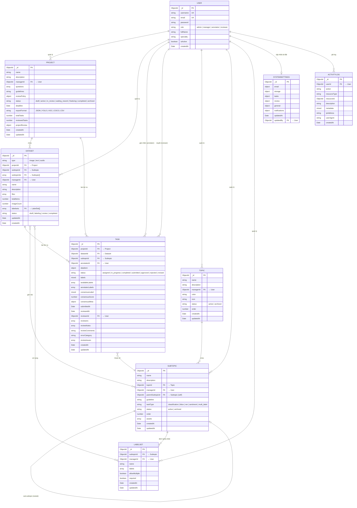

# Entity-Relationship Diagram — Data Labeling Platform (LabelFlow)

> **Loại trừ:** Reward, UserScore, Warning (đã xóa hoặc không liên quan)

---

## Mermaid ER Diagram



---

## Taxonomic Hierarchy (Cấu trúc phân cấp)

```
Topic
  └── Subtopic (nested: parentSubtopicId self-reference)
        ├── LabelSet
        │     └── Label { name, color, description, shortcut }
        └── Assets (files: image/audio/text)
              └── Dataset
                    └── Project
                          └── Task
                                ├── Annotator (User)
                                │     └── gán nhãn → labels
                                └── Reviewer (User)
                                      └── duyệt → approved/rejected/revised
```

---

## Label Resolution Chain

```
Dataset.subtopicIds
  → Subtopic
      → LabelSet (linked)
          → Label[] → dùng trong Task.labels
```

---

## Task Status Flow

```
assigned
  → in_progress (annotator đang làm)
  → completed (annotator xong nhưng chưa nộp)
  → submitted (annotator nộp cho reviewer)
  → approved (reviewer duyệt) ✅
  → rejected (reviewer từ chối) → annotator sửa
  → revised (annotator sửa xong nộp lại)
  → approved / rejected (reviewer duyệt lại)
```

---

## Review Voting Flow (Multi-reviewer)

```
Task (1 item)
  ├── reviewers[] = [{ reviewerId, status: 'pending'|'approved'|'rejected' }]
  ├── annotatorLabels[] = [{ annotatorId, labels, submittedAt }]
  ├── consensusLabel     = kết quả cuối cùng
  └── consensusScore     = 0–1
```

---

## API Endpoints chính

| Method | Endpoint | Mô tả |
|--------|----------|--------|
| POST | `/api/auth/login` | Đăng nhập |
| GET | `/api/tasks/my-tasks` | Tasks theo role |
| POST | `/api/tasks/:id/submit` | Annotator nộp task |
| POST | `/api/reviews/:id/approve` | Reviewer duyệt |
| POST | `/api/reviews/:id/reject` | Reviewer từ chối |
| GET | `/api/datasets/:id/final-export` | Export approved items |
| GET | `/api/projects/:id/export` | Export theo project |
| GET | `/api/reviews/pending` | Queue review |
| GET | `/api/reviews/projects/:id/subtopics` | Review breakdown |
| GET | `/api/topics` | Taxonomy |
